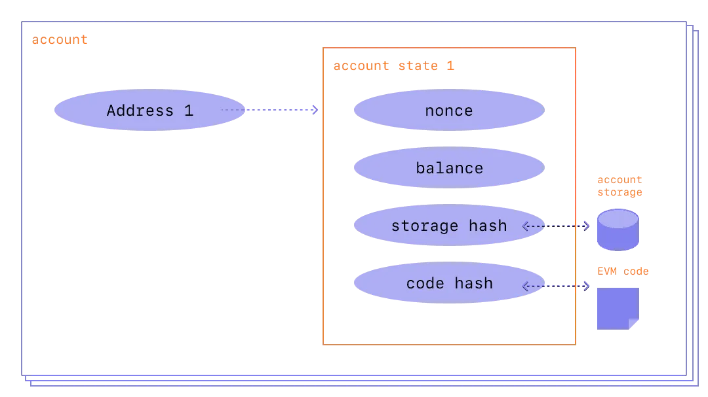

# Introduction to the EVM

## What is VM?

-   A virtual machine (VM) is, in general, a piece of software that simulates a full computer system—complete with its own CPU, memory, storage, and operating environment—inside another, “host” environment.
-   We can simply think of it as **“computer within a computer”**.

## What is the EVM?

-   The Ethereum Virtual Machine (EVM) is the computation engine at the heart of the Ethereum protocol.
-   It is sometimes described as a **“world computer”** because every node in the Ethereum network runs an instance of the EVM, verifying the same instructions and state transitions.

-   **Virtual Machine**: Like a computer operating system but specialized for running Ethereum’s smart contracts.
-   **Isolated Execution**: The EVM provides a **sandboxed** environment. Contracts can only access and modify Ethereum state via the EVM’s rules and resources (stack, memory, storage).

## Why Does Ethereum Need a Virtual Machine?

1. **Smart Contract Execution**:

-   Ethereum extends the concept of a blockchain from simple token transfers (like Bitcoin) to **arbitrary code** execution.
-   The EVM enforces security, ensures deterministic outcomes, and provides a uniform standard for all smart contract transactions.

2. **Deterministic & Trustless**:

-   Every node runs the same EVM code, ensuring **consensus** about the state.
-   No matter which node executes a transaction, the result is guaranteed to be the same (assuming honest consensus).

3. **Stateful Contracts**:

-   Contracts can maintain **persistent state** in Ethereum’s world state—something not natively provided by earlier blockchain systems.
-   The EVM manages how contracts read/write this state, ensuring correctness and preventing unauthorized access.

4. **Gas & Resource Management**:

-   The EVM incorporates the concept of **gas** to meter execution. This prevents infinite loops or spam, since each instruction consumes gas.
-   Users pay for the computation they trigger, aligning incentives with network resources.

## EVM vs. Traditional Computing Models

1. **World State**:

-   Unlike traditional systems where each program runs on a personal computer, the EVM’s state is **global** and replicated across all Ethereum nodes.
-   Every node has the same ledger and contract storage, guaranteeing **consistent data**.

2. **Deterministic Execution**:

-   The EVM must be fully deterministic: given the same transaction, every node must arrive at the same outcome.
-   Randomness, timing, or external system calls are heavily restricted or simulated via on-chain patterns (e.g., block hash for pseudo-randomness).

3. **Immutability & Code**:

-   Once deployed, a contract’s bytecode is **immutable** (unless using patterns like proxies).
-   The code cannot be changed after deployment, which is key to trust minimization but also demands careful design for upgrades.

# EVM Architecture

-   The Ethereum Virtual Machine (EVM) is often described as a **state machine** running atop a Harvard-style architecture.
-   This design influences how contracts store code, manage data, and interact with the rest of the blockchain.

## The EVM as a Stack-Based Machine

1. **Stack-Oriented Execution**

-   Internally, the EVM uses a **stack** to execute instructions.
-   Each instruction can push or pop 256-bit words from this stack.
-   The stack has a maximum depth of 1,024 elements—exceeding this limit reverts the transaction.

2. **Harvard Architecture vs. Von Neumann**

-   Traditional computers (von Neumann architecture) store code and data in a single memory space.
-   In the EVM (somewhat inspired by a Harvard architecture concept), **code is immutable and separate**. You can’t modify contract bytecode at runtime.
-   The contract’s **storage** is distinct from its runtime code and from the ephemeral memory region used during execution.

3. **Instruction Set**

-   The EVM has a specialized set of opcodes (e.g., `ADD`, `MUL`, `CALL`, `CREATE`, `SSTORE`, etc.).
-   Each opcode manipulates the stack, memory, or storage.
-   The EVM’s design ensures deterministic execution—every node processes instructions identically.

## The Account Model

Ethereum differs from many older blockchains (like Bitcoin) by employing an **account-based** model rather than a UTXO model. This is critical to how the EVM tracks state.

1. **Two Types of Accounts**

-   **Externally Owned Accounts (EOAs)**: Controlled by private keys (e.g., user wallets). They have no code.
-   **Contract Accounts**: Hold contract code (bytecode) and can contain persistent storage.

2. **Account Fields**

-   **Nonce**: Number of transactions sent from an account (for EOAs) or number of contract creations performed by that account (for contract accounts).
-   **Balance**: Amount of Ether (in wei) owned by the account.
-   **Storage Root**: A hash (root of a Merkle Patricia Trie) representing the contract’s storage data.
-   **Code Hash**: A hash of the contract’s bytecode, from which code can be retrieved.

3. **Contract Code & Storage**

-   A contract’s **runtime code** is immutable after deployment.
-   Contract storage is a key-value store, mapping 256-bit slots to 256-bit values. This is where a contract’s persistent state lives.

## Global State Tree

1. **Merkle Patricia Trie**

-   Ethereum organizes the entire “world state” in a data structure called a **Merkle Patricia Trie (MPT)**.
-   Each account is a node in this tree, keyed by its address.
-   The trie’s root hash is stored in the block header, providing a **tamper-evident** record of the entire state.

2. **Per-Contract Storage Trie**

-   Each contract account has its own separate **storage** MPT.
-   Accessing or changing contract storage updates this sub-trie, affecting the main state root.

3. **Why a Trie?**

-   Ensures **efficient** and **verifiable** lookups of any account or storage slot.
-   Supports **light clients** or partial proofs about specific state data without revealing the entire state.

## EVM Memory Model

During transaction execution, the EVM provides **ephemeral** storage areas:

1. **Memory**

-   A contiguous byte-array that resets after each transaction.
-   Typically used for **intermediate** data manipulation or ABI encoding/decoding.
-   Cost grows with **how much memory is accessed** (32-byte increments).

2. **Stack**

-   A LIFO stack for pushing/popping 256-bit words.
-   Used for **operands** of arithmetic, logical operations, etc.

3. **Transient vs. Persistent**

-   **Memory and stack** are transient: they exist only during the function execution.
-   **Contract storage** is persistent: changes remain after the transaction ends.

## Distinction Between Code and Data

1. **Code Section**

-   A contract’s deployed bytecode is immutable.
-   The EVM can only execute code (read as instructions); it cannot modify it or treat it as storage.

2. **Data (Storage, Memory, Call Data)**

-   **Storage**: persistent, contract-specific key-value store.
-   **Memory**: ephemeral, used for dynamic data within a transaction.
-   **Calldata**: the input payload of a transaction or message call, read-only.

3. **Why Is This Important?**

-   This separation enforces that smart contract logic is not self-modifying.
-   Contracts operate on **immutable code** with mutable data in a safe, isolated manner.

## Contract Calls & Message Layer

1. **Messaging**

-   Contracts communicate with each other via message calls (low-level opcodes like `CALL`, `DELEGATECALL`, `STATICCALL`).
-   Each call spawns a new, nested EVM execution context with its own memory.

2. **Depth Limitation**

-   There’s a max call depth (1024), preventing infinitely recursive calls.

3. **Gas Forwarding**

-   Each call can specify how much gas to forward to the callee, ensuring the caller can maintain enough gas to handle results or reverts.

## Putting It All Together

At a high level:

-   **Every Ethereum node** maintains a replicated copy of the global state (the Merkle trie of accounts).
-   When a user or contract triggers a transaction, the EVM on each node executes the same bytecode instructions, modifies contract storage or account balances accordingly, and yields a **deterministic result**.
-   By combining a **stack-based instruction set**, a **clear separation** of code vs. data, and cryptographic tries for storing global state, the EVM ensures **consistency, isolation, and auditability** for every smart contract operation on Ethereum.

