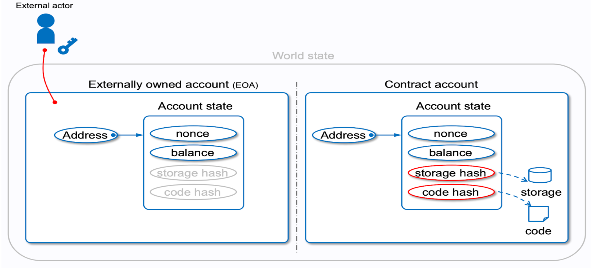
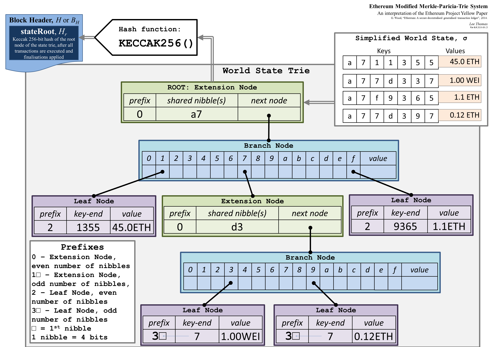
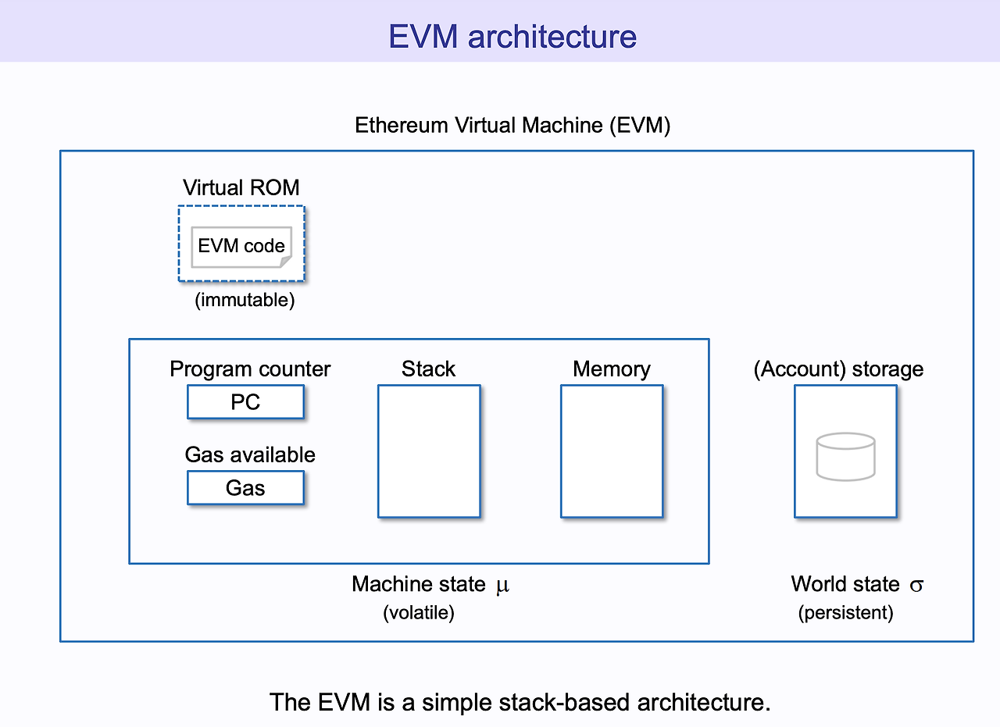
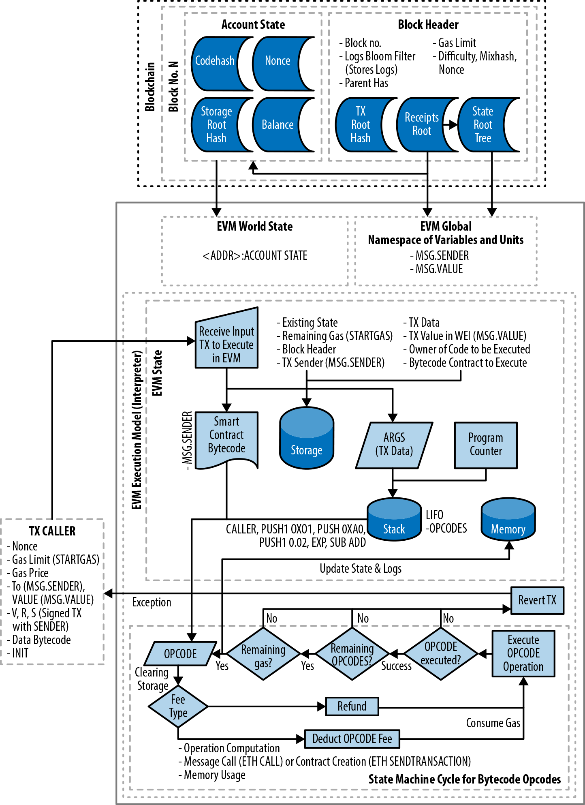
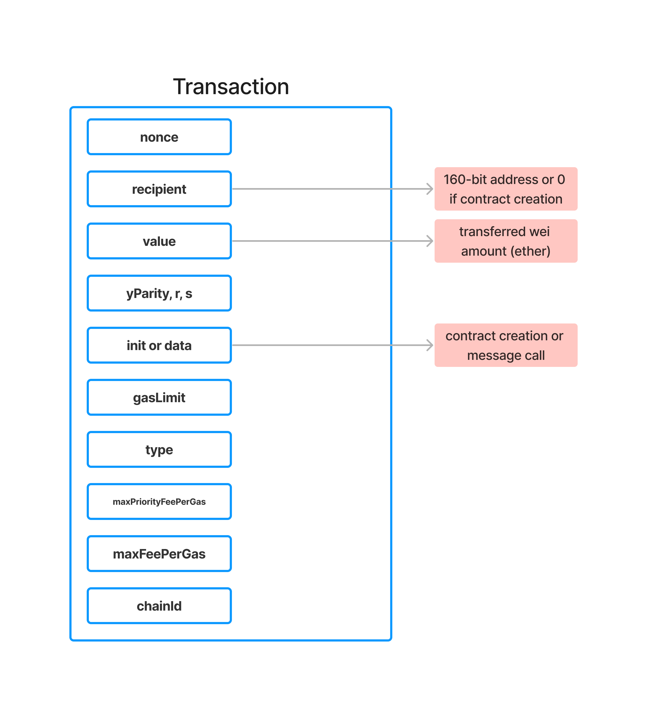

# Table of Contents

-   [Introduction to the EVM](#introduction-to-the-evm)
-   [EVM Architecture](#evm-architecture)
-   [EVM Execution Environment](#evm-execution-environment)
-   [Transaction Processing](#transaction-processing)

# Introduction to the EVM

## What is VM?

-   A virtual machine (VM) is, in general, a piece of software that simulates a full computer system—complete with its own CPU, memory, storage, and operating environment—inside another, “host” environment.
-   We can simply think of it as **“computer within a computer”**.

## What is the EVM?

-   The Ethereum Virtual Machine (EVM) is the computation engine at the heart of the Ethereum protocol.
-   It is sometimes described as a **“world computer”** because every node in the Ethereum network runs an instance of the EVM, verifying the same instructions and state transitions.

-   **Virtual Machine**: Like a computer operating system but specialized for running Ethereum’s smart contracts.
-   **Isolated Execution**: The EVM provides a **sandboxed** environment. Contracts can only access and modify Ethereum state via the EVM’s rules and resources (stack, memory, storage).

## Why Does Ethereum Need a Virtual Machine?

1. **Smart Contract Execution**:

-   Ethereum extends the concept of a blockchain from simple token transfers (like Bitcoin) to **arbitrary code** execution.
-   The EVM enforces security, ensures deterministic outcomes, and provides a uniform standard for all smart contract transactions.

2. **Deterministic & Trustless**:

-   Every node runs the same EVM code, ensuring **consensus** about the state.
-   No matter which node executes a transaction, the result is guaranteed to be the same (assuming honest consensus).

3. **Stateful Contracts**:

-   Contracts can maintain **persistent state** in Ethereum’s world state—something not natively provided by earlier blockchain systems.
-   The EVM manages how contracts read/write this state, ensuring correctness and preventing unauthorized access.

4. **Gas & Resource Management**:

-   The EVM incorporates the concept of **gas** to meter execution. This prevents infinite loops or spam, since each instruction consumes gas.
-   Users pay for the computation they trigger, aligning incentives with network resources.

## EVM vs. Traditional Computing Models

1. **World State**:

-   Unlike traditional systems where each program runs on a personal computer, the EVM’s state is **global** and replicated across all Ethereum nodes.
-   Every node has the same ledger and contract storage, guaranteeing **consistent data**.

2. **Deterministic Execution**:

-   The EVM must be fully deterministic: given the same transaction, every node must arrive at the same outcome.
-   Randomness, timing, or external system calls are heavily restricted or simulated via on-chain patterns (e.g., block hash for pseudo-randomness).

3. **Immutability & Code**:

-   Once deployed, a contract’s bytecode is **immutable** (unless using patterns like proxies).
-   The code cannot be changed after deployment, which is key to trust minimization but also demands careful design for upgrades.

# EVM Architecture

-   The Ethereum Virtual Machine (EVM) is often described as a **state machine** running atop a Harvard-style architecture.
-   This design influences how contracts store code, manage data, and interact with the rest of the blockchain.

## The EVM as a Stack-Based Machine

1. **Stack-Oriented Execution**

-   Internally, the EVM uses a **stack** to execute instructions.
-   Each instruction can push or pop 256-bit words from this stack.
-   The stack has a maximum depth of 1,024 elements—exceeding this limit reverts the transaction.

2. **Harvard Architecture vs. Von Neumann**

-   Traditional computers (von Neumann architecture) store code and data in a single memory space.
-   In the EVM (somewhat inspired by a Harvard architecture concept), **code is immutable and separate**. You can’t modify contract bytecode at runtime.
-   The contract’s **storage** is distinct from its runtime code and from the ephemeral memory region used during execution.

3. **Instruction Set**

-   The EVM has a specialized set of opcodes (e.g., `ADD`, `MUL`, `CALL`, `CREATE`, `SSTORE`, etc.).
-   Each opcode manipulates the stack, memory, or storage.
-   The EVM’s design ensures deterministic execution—every node processes instructions identically.

## The Account Model

Ethereum differs from many older blockchains (like Bitcoin) by employing an **account-based** model rather than a UTXO model. This is critical to how the EVM tracks state.

1. **Two Types of Accounts**

-   **Externally Owned Accounts (EOAs)**: Controlled by private keys (e.g., user wallets). They have no code.
-   **Contract Accounts**: Hold contract code (bytecode) and can contain persistent storage.



1. **Account Fields**

-   **Nonce**: Number of transactions sent from an account (for EOAs) or number of contract creations performed by that account (for contract accounts).
-   **Balance**: Amount of Ether (in wei) owned by the account.
-   **Storage Root**: A hash (root of a Merkle Patricia Trie) representing the contract’s storage data.
-   **Code Hash**: A hash of the contract’s bytecode, from which code can be retrieved.

3. **Contract Code & Storage**

-   A contract’s **runtime code** is immutable after deployment.
-   Contract storage is a key-value store, mapping 256-bit slots to 256-bit values. This is where a contract’s persistent state lives.

## Global State Tree



1. **Merkle Patricia Trie**

-   Ethereum organizes the entire “world state” in a data structure called a **Merkle Patricia Trie (MPT)**.
-   Each account is a node in this tree, keyed by its address.
-   The trie’s root hash is stored in the block header, providing a **tamper-evident** record of the entire state.

2. **Per-Contract Storage Trie**

-   Each contract account has its own separate **storage** MPT.
-   Accessing or changing contract storage updates this sub-trie, affecting the main state root.

3. **Why a Trie?**

-   Ensures **efficient** and **verifiable** lookups of any account or storage slot.
-   Supports **light clients** or partial proofs about specific state data without revealing the entire state.

## EVM Memory Model



During transaction execution, the EVM provides **ephemeral** storage areas:

1. **Memory**

-   A contiguous byte-array that resets after each transaction.
-   Typically used for **intermediate** data manipulation or ABI encoding/decoding.
-   Cost grows with **how much memory is accessed** (32-byte increments).

2. **Stack**

-   A LIFO stack for pushing/popping 256-bit words.
-   Used for **operands** of arithmetic, logical operations, etc.

3. **Transient vs. Persistent**

-   **Memory and stack** are transient: they exist only during the function execution.
-   **Contract storage** is persistent: changes remain after the transaction ends.

## Distinction Between Code and Data

1. **Code Section**

-   A contract’s deployed bytecode is immutable.
-   The EVM can only execute code (read as instructions); it cannot modify it or treat it as storage.

2. **Data (Storage, Memory, Call Data)**

-   **Storage**: persistent, contract-specific key-value store.
-   **Memory**: ephemeral, used for dynamic data within a transaction.
-   **Calldata**: the input payload of a transaction or message call, read-only.

3. **Why Is This Important?**

-   This separation enforces that smart contract logic is not self-modifying.
-   Contracts operate on **immutable code** with mutable data in a safe, isolated manner.

## Contract Calls & Message Layer

1. **Messaging**

-   Contracts communicate with each other via message calls (low-level opcodes like `CALL`, `DELEGATECALL`, `STATICCALL`).
-   Each call spawns a new, nested EVM execution context with its own memory.

2. **Depth Limitation**

-   There’s a max call depth (1024), preventing infinitely recursive calls.

3. **Gas Forwarding**

-   Each call can specify how much gas to forward to the callee, ensuring the caller can maintain enough gas to handle results or reverts.

## Putting It All Together

At a high level:

-   **Every Ethereum node** maintains a replicated copy of the global state (the Merkle trie of accounts).
-   When a user or contract triggers a transaction, the EVM on each node executes the same bytecode instructions, modifies contract storage or account balances accordingly, and yields a **deterministic result**.
-   By combining a **stack-based instruction set**, a **clear separation** of code vs. data, and cryptographic tries for storing global state, the EVM ensures **consistency, isolation, and auditability** for every smart contract operation on Ethereum.



# EVM Execution Environment

-   The **execution environment** in the Ethereum Virtual Machine (EVM) refers to all the **contextual data** and **runtime resources** provided to a piece of executing code during a transaction or message call.
-   Each invocation (transaction, call, `create` operation) has its own environment that dictates which opcodes are available, how they behave, and what data they can access.

## Overview of Execution Context

When the EVM runs a transaction or an internal message call, it sets up several context variables:

1. **`msg.sender`**

-   The address that initiated this call.
    For the **top-level transaction**, msg.sender is the Externally Owned Account (EOA) that signed and sent the transaction.
    For **internal calls**, msg.sender is the calling contract.

2. **`msg.value`**

-   The amount of Ether (in wei) sent along with this call/transaction.
-   If a function is not `payable`, sending Ether to it will revert.

3. **`msg.data`**

-   The raw call data (bytes) passed to the function, including the function selector plus encoded parameters.
-   In Solidity, function arguments are typically decoded from `msg.data` automatically under the hood.

4. **`tx.origin`**

-   The **original sender** of the top-level transaction (always an EOA).
-   Generally **not** recommended for authorization checks because it can be exploited via calls from malicious contracts.

5. **`gas`**

-   The amount of gas allocated to this execution context. If the code runs out of gas, it reverts.
-   You can optionally specify how much gas to forward in low-level calls like `call`/`delegatecall`.

6. **Address Variables**

-   `address(this)`: the address of the executing contract.
-   `msg.sender`: as above, the immediate caller.
-   In an **internal** `delegatecall`, `address(this)` is still the proxy (caller), not the implementation contract.

8. **Block Context (accessible via opcodes or global variables)**

-   `block.number`: The current block number.
-   `block.timestamp`: The current block’s timestamp (in seconds).
-   `block.coinbase`: The miner/validator’s address.
-   `block.difficulty` or `block.prevrandao`: In older versions, used for difficulty; now it’s used differently in PoS. A random number provided by the beacon chain.

9. **Transaction Context**

-   `tx.gasprice`: The gas price of the transaction.
-   `tx.origin`: The EOA that started the transaction (mentioned above).

These values define the **who, how much, and why** of the current EVM call frame.

## Transaction Lifecycle

A **transaction** is the external entry point into the Ethereum state transition. It leads to the following steps:

1. **Signature & Validation**

-   The network verifies the transaction’s signature (which EOA signed it) and checks if the sender’s **nonce** is correct.
-   The transaction includes gas details (gas limit, max fee per gas, etc.) which must be sufficient.

2. **State Preparation**

-   The EVM deducts the **upfront gas cost** from the sender’s balance.
-   Sets up the execution environment, populating `msg.sender`, `msg.value`, `msg.data`, etc.

3. **Execution**

-   The EVM runs the specified code (e.g., calling a contract function or deploying a contract).
-   Any errors (e.g., out of gas, revert) cause the **entire state change** to revert.

4. **Final State & Receipt**

-   If successful, any state changes (storage updates, Ether transfers) are committed.
-   Remaining gas is refunded appropriately, and a transaction **receipt** is produced with logs/events.

# Transaction Processing

-   In Ethereum, **transactions** are the mechanism by which **state transitions** happen in the EVM.
-   Whether you’re transferring Ether between accounts or invoking a smart contract, it all starts with a transaction.

## Types of Transactions

1. **Externally Owned Account (EOA) → Contract/Account**

-   A user (with a private key) initiates a transaction to call a contract or simply transfer Ether to another address.

2. **Contract → Contract (Message Calls)**

-   Within the EVM, a contract can trigger internal calls, but these are **not top-level transactions**. They’re **sub-calls within an existing transaction**.

3. **Contract Creation**

-   A special transaction without a `to` address, containing contract **creation code** in the data payload.
-   If successful, it deploys a new contract instance with its own address.

## Transaction Fields (Based on EIP-1559)



1. **nonce**

-   A per-account counter that ensures each transaction from a given account can only be processed once and in order.
-   A transaction is valid only if its nonce matches the account’s next expected nonce on chain.

2. **recipient**

-   The 160‑bit address that should receive the transaction. If this field is set to the “zero address” (all zeroes), the transaction is creating a contract instead of sending funds or calling a function.

3. **value**

-   The amount of Ether (in wei) being transferred to the recipient. In contract-creation transactions, this is the initial funding amount for the new contract.

4. **yParity, r, s**

-   These are the **signature** parameters used to verify that the transaction was authorized by the sender’s private key (via ECDSA).
-   `r` and `s` are outputs of the ECDSA signature algorithm.
-   `yParity` (sometimes called “v” in legacy transactions) indicates which of the two possible public key solutions was used in the ECDSA signature (it also encodes chain ID in older legacy transactions).

5. **init or data**

-   Holds code for **contract creation** (the new contract’s initialization/constructor bytecode) or **input data for a message call** (function selector + arguments for an existing contract).

6. **gasLimit**

-   The maximum amount of gas the transaction’s execution can consume. If the execution runs out of gas, it reverts. Any unused gas is refunded to the sender.

7. **type**

-   An indicator introduced by EIP‑2718 for “typed transactions.”
-   Common types:
    -   0 for legacy transactions,
    -   1 (EIP‑2930 “access list”),
    -   2 (EIP‑1559 “dynamic fee” transactions).
    -   3 (EIP‑4844 “blob” transactions).

8. **maxPriorityFeePerGas**

-   The “tip” per gas that goes to the block producer (miner or validator).
-   Under EIP‑1559, the base fee is burned, and only the priority fee (tip) is received by the block producer.

9. **maxFeePerGas**

-   The total maximum fee (base fee + priority fee) the sender is willing to pay per gas.
-   If the actual base fee is lower, the user pays less; but this caps what the user can be charged.

10. **chainId**

-   The unique identifier for the Ethereum network (e.g. 1 for Mainnet, 11155111 for Sepolia).
-   It’s used in the transaction signing process (part of EIP‑155) to prevent replay attacks on different chains.

# Instruction Set & Gas Model

-   The EVM is a **stack-based** machine that processes bytecode instructions (opcodes).
-   Each opcode performs a specific action (e.g., arithmetic, control flow, environment queries, storage access) and consumes a certain amount of gas.
-   This gas model ensures that computational resources are accounted for and prevents abuse like infinite loops or excessive resource consumption.

## EVM Instruction Set Overview

You can find the full list of opcodes [here](https://www.evm.codes/).

1. **Arithmetic & Logic**

-   `ADD, SUB, MUL, DIV, MOD`: Basic arithmetic on 256-bit integers.
-   `AND, OR, XOR, NOT`: Bitwise operations.
-   `SHL, SHR`: Bit shifting.

1. **Stack Management**

-   `PUSHn`: Pushes an n-byte immediate value onto the stack (e.g., PUSH1 for 1 byte, up to PUSH32).
-   `POP`: Removes the top stack item.
-   `DUPn`: Duplicates the n-th item from the top of the stack.
-   `SWAPn`: Swaps the top stack item with the n-th item.

3. **Memory & Storage**

-   `MLOAD, MSTORE, MSTORE8`: Read/write to memory (ephemeral during execution).
-   `SLOAD, SSTORE`: Read/write to contract storage (persists between executions).
-   `CALLDATACOPY, CODECOPY`: Copy data from call input or contract’s code to memory.

4. **Control Flow**

-   `JUMP, JUMPI`: Unconditional/conditional jump to a program counter (PC) location.
-   `PC`: Get the current program counter.
-   `STOP`: Terminate execution successfully.
-   `REVERT`: Revert execution, undoing state changes.

5. **System / Environmental**

-   `BLOCKHASH`: Get the hash of a recent block.
-   `COINBASE, TIMESTAMP, NUMBER`: Block metadata (miner address, block timestamp, block number).
-   `GASPRICE`: Current transaction gas price.
-   `CALLVALUE, CALLDATASIZE, CALLDATALOAD`: Information about the current call.
-   `ADDRESS, ORIGIN, CALLER`: The contract’s own address, origin of the transaction, and immediate caller.

6. **Contract Calls / Creation**

-   `CALL, DELEGATECALL, STATICCALL`: Invoke other contracts (or self) in various modes.
-   `CREATE, CREATE2`: Deploy a new contract, returning its new address.

7. **Logs & Self-Destruct**

-   `LOG0 through LOG4`: Emit an event log with up to 4 indexed topics.
-   `SELFDESTRUCT`: Destroy the current contract, sending remaining Ether to a specified address, and freeing storage (often yielding a gas refund).

## Gas & Why It’s Needed

The **gas mechanism** in Ethereum ensures that every instruction or operation has a **cost**. This cost is paid by the transaction sender to:

1. **Prevent Infinite Loops**: Without gas, a contract could loop forever, consuming network resources indefinitely.
2. **Incentivize Efficient Code**: Contracts and dApps must optimize logic to keep gas costs reasonable.
3. **Compensate Network Validators**: The fee covers the computational resources used to validate and execute the transaction on all nodes.

## Gas Costs of Common Opcodes

Each opcode has a base gas cost defined in the Yellow Paper or subsequent EIPs. For example:

-   `ADD / SUB`: 3 gas.
-   `MUL`: 5 gas.
-   `DIV / MOD`: 5 gas.
-   `SLOAD`: Typically 2100 gas (though it can vary by context/EIPs like EIP-2929 or EIP-2200).
-   `SSTORE`: Cost can be 20,000 gas if you’re writing a zero → non-zero storage slot, 5,000 gas if non-zero → zero, or a partial refund if you’re clearing a slot from non-zero to zero.
-   `CALL`: Base 700 gas, plus dynamic gas for passing data, forwarding gas, etc.

These values can be updated via EIPs (like EIP-150, EIP-2028, EIP-2929), meaning the gas schedule can evolve to match real costs of execution or to mitigate certain DoS vectors.

## Dynamic Gas Factors

1. **Memory Expansion**

-   Accessing a higher memory index (e.g., storing data at a large offset) can cause a **memory expansion cost**.
-   Gas usage grows quadratically (or in step increments) with how large the active memory region becomes.

2. **Storage Writes (`SSTORE`)**

-   The cost depends on whether you’re creating a new storage slot (non-zero) or updating an existing one.
-   Clearing a storage slot (setting it to zero) can grant a **partial gas refund** (up to half of the total gas used in the transaction). This encourages freeing storage.

3. **Call-Related**

-   `CALL` and friends have overhead costs plus a certain amount of gas forwarded to the callee.
-   The callee might run out of gas if not enough is forwarded, causing a revert.

4. **Data Copying**

-   Copying large amounts of data (e.g., using `CALLDATACOPY` or returning large data from a call) can have costs proportional to data size.

## Gas Refunds

1. **When Refunds Occur**

-   `SELFDESTRUCT`: If a contract self-destructs, it cleans up its storage, yielding a significant refund (though EIP-3529 and others have adjusted or reduced SELFDESTRUCT refunds).
-   `SSTORE`: Setting a storage slot from a non-zero value to zero can yield a partial refund.

2. **Refund Limit**

-   Refunds cannot exceed half of the total gas consumed by the transaction.
-   This prevents extreme refund exploitation.

## The Block Gas Limit / Target

1. **Per-Transaction Gas Limit**

-   Each transaction has a specified `gasLimit` set by the sender, ensuring they don’t run out of funds if the transaction is complex or loops.

2. **Block Gas Limit / Target**

-   Each block has a **max amount of gas** that all included transactions can consume.
-   Under Proof-of-Stake and EIP-1559, we often talk about a “target gas limit” which can float slightly with base fee adjustments.
-   This ensures blocks don’t become arbitrarily large and helps keep node requirements stable.

# Self-Destruct & State Clearing

-   In Ethereum, contracts can be permanently destroyed via the `SELFDESTRUCT` opcode (invoked through `selfdestruct(address recipient)` in older Solidity versions or `address(this)selfdestruct(...)` in inline assembly).
-   When triggered, the contract’s code and storage are effectively removed from the state, and any remaining Ether is transferred to a specified recipient address.
-   This process also can yield a **gas refund** for clearing storage.

```solidity
contract SelfDestructExample {
    address public owner;

    constructor() {
        owner = msg.sender;
    }

    function kill(address payable _recipient) external {
        require(msg.sender == owner, "Not authorized");
        // Transfer remaining Ether to _recipient and destroy the contract
        selfdestruct(_recipient);
    }
}
```

## What Is Self-Destruct?

1. **Definition**

-   `SELFDESTRUCT` is an EVM opcode that **deletes** the contract’s code from the state and marks its storage as freed.
-   The contract’s Ether balance is sent to a designated address (`recipient`).
-   After self-destruction, the contract’s code is no longer callable or stored on-chain, although the **address** itself can still receive Ether if it’s called (it just won’t have code to execute).

2. **Usage in Solidity**

-   Historically, one would write `selfdestruct(recipient)` within a contract function.
-   In newer Solidity versions (from 0.8.18 onward), `selfdestruct` is discouraged or restricted because it complicates certain security assumptions (like code immutability).
-   Some dev teams ban it altogether in production code unless they have a specific use case.

3. **Refund Mechanism**

-   When `SELFDESTRUCT` is called, the EVM typically grants a gas refund for freeing the contract’s storage.
-   Over time, EIPs have reduced or planned to remove the refund from `SELFDESTRUCT` (e.g., EIP-3529). The protocol has moved away from encouraging self-destruct as a storage relief measure.

## Redeploying at the Same Address

1. **Same Address, Fresh Code**

-   Normally, once a contract self-destructs, that address is considered “dead code.”
-   But in Ethereum, the address can **theoretically** receive a new contract’s code later if someone uses `CREATE2` with the same parameters to produce that address.
-   This phenomenon is sometimes referred to as “**contract resurrection**” or “**re-deploying** at the same address.”

2. **Security Implications**

-   If external code assumes that self-destruct means “address is forever gone,” it could be vulnerable. Another contract with new logic could appear at the same address in the future.
-   Good practice: Do not rely on self-destruct for permanent immutability of an address. With `CREATE2`, the old address can be revived with new code if the same salt and init code are used.
